# **#06 | Layout dan Navigasi**

## **Praktikum 1: Membangun Layout di Flutter**

### **Langkah 1: Buat Project Baru**

Buatlah sebuah project flutter baru dengan nama **layout_flutter**. Atau sesuaikan style laporan praktikum yang Anda buat.

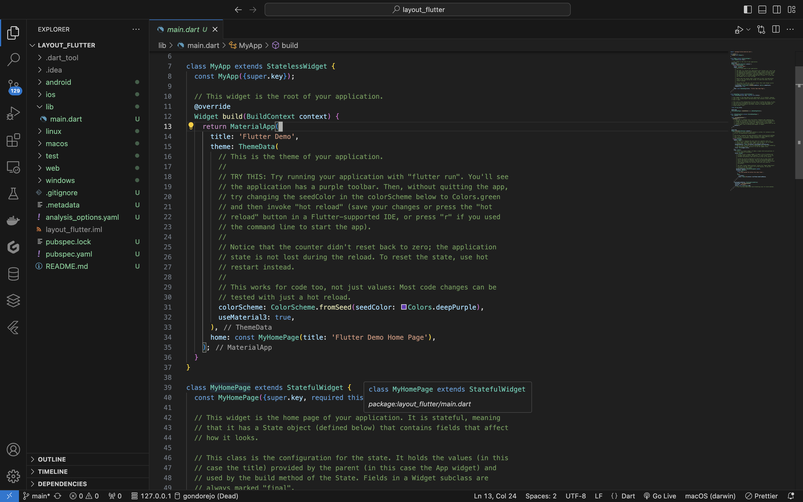

### **Langkah 2: Buka file `lib/main.dart`**

Buka file `main.dart` lalu ganti dengan kode berikut. Isi nama dan NIM Anda di `text title`.

```Dart
import 'package:flutter/material.dart';

void main() => runApp(const MyApp());

class MyApp extends StatelessWidget {
  const MyApp({super.key});

  @override
  Widget build(BuildContext context) {
    return MaterialApp(
      title: 'Flutter layout: Nama dan NIM Anda',
      home: Scaffold(
        appBar: AppBar(
          title: const Text('Flutter layout demo'),
        ),
        body: const Center(
          child: Text('Hello World'),
        ),
      ),
    );
  }
}
```

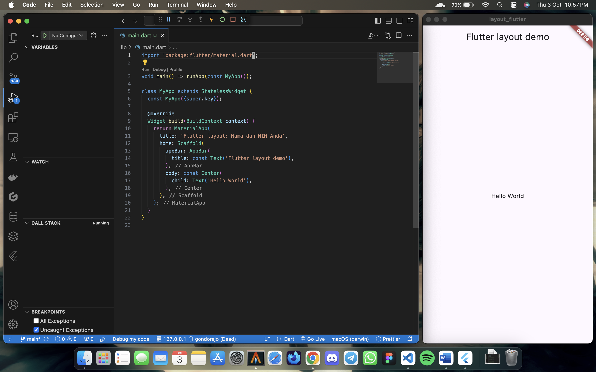

### **Langkah 4: Implementasi title row**

Pertama, Anda akan membuat kolom bagian kiri pada judul. Tambahkan kode berikut di bagian atas metode `build()` di dalam kelas `MyApp`:

```Dart
Widget titleSection = Container(
  padding: const EdgeInsets.all(...),
  child: Row(
    children: [
      Expanded(
        /* soal 1*/
        child: Column(
          crossAxisAlignment: ...,
          children: [
            /* soal 2*/
            Container(
              padding: const EdgeInsets.only(bottom: ...),
              child: const Text(
                'Wisata Gunung di Batu',
                style: TextStyle(
                  fontWeight: FontWeight.bold,
                ),
              ),
            ),
            Text(
              'Batu, Malang, Indonesia',
              style: TextStyle(...),
            ),
          ],
        ),
      ),
      /* soal 3*/
      Icon(
       ...,
        color: ...,
      ),
      const Text(...),
    ],
  ),
);
```

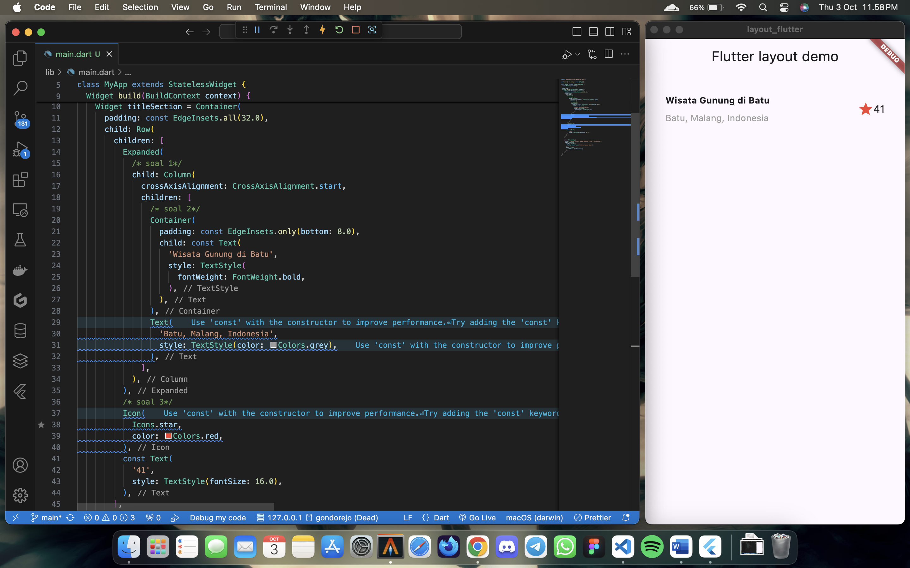

## **Praktikum 2: Implementasi button row**

### **Langkah 1: Buat method Column \_buildButtonColumn**

Bagian tombol berisi 3 kolom yang menggunakan tata letak yang sama—sebuah ikon di atas baris teks. Kolom pada baris ini diberi jarak yang sama, dan teks serta ikon diberi warna primer.

Karena kode untuk membangun setiap kolom hampir sama, buatlah metode pembantu pribadi bernama `buildButtonColumn()`, yang mempunyai parameter warna, `Icon` dan `Text`, sehingga dapat mengembalikan kolom dengan widgetnya sesuai dengan warna tertentu.

```Dart
class MyApp extends StatelessWidget {
  const MyApp({super.key});

  @override
  Widget build(BuildContext context) {
    // ···
  }

  Column _buildButtonColumn(Color color, IconData icon, String label) {
    return Column(
      mainAxisSize: MainAxisSize.min,
      mainAxisAlignment: MainAxisAlignment.center,
      children: [
        Icon(icon, color: color),
        Container(
          margin: const EdgeInsets.only(top: 8),
          child: Text(
            label,
            style: TextStyle(
              fontSize: 12,
              fontWeight: FontWeight.w400,
              color: color,
            ),
          ),
        ),
      ],
    );
  }
}
```

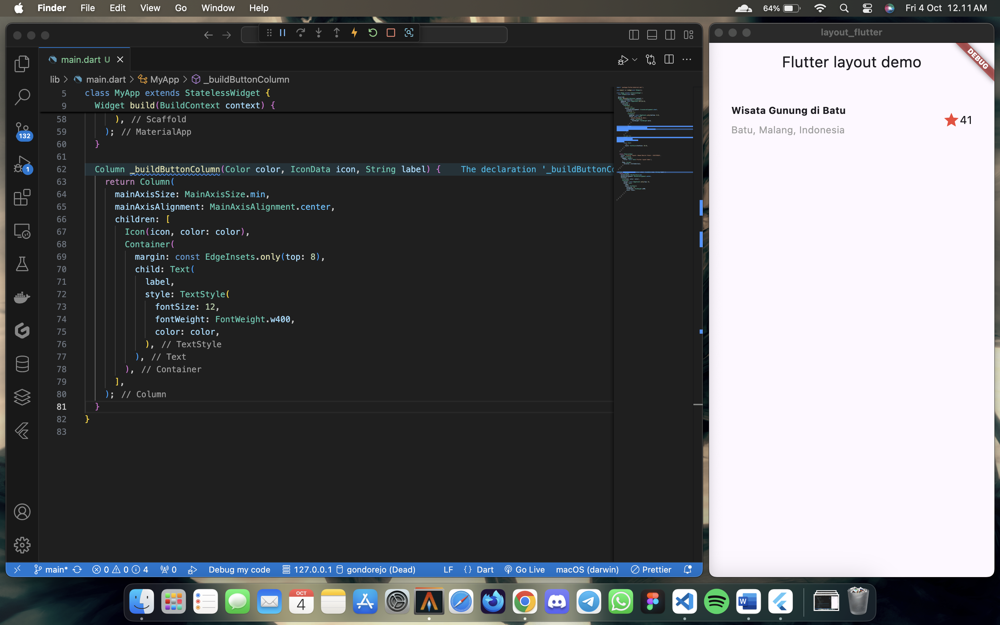

### **Langkah 2: Buat widget buttonSection**

Buat Fungsi untuk menambahkan ikon langsung ke kolom. Teks berada di dalam `Container` dengan margin hanya di bagian atas, yang memisahkan teks dari ikon.

Bangun baris yang berisi kolom-kolom ini dengan memanggil fungsi dan set warna, `Icon`, dan teks khusus melalui parameter ke kolom tersebut. Sejajarkan kolom di sepanjang sumbu utama menggunakan `MainAxisAlignment.spaceEvenly` untuk mengatur ruang kosong secara merata sebelum, di antara, dan setelah setiap kolom. Tambahkan kode berikut tepat di bawah deklarasi `titleSection` di dalam metode `build()`:

```Dart
Color color = Theme.of(context).primaryColor;

Widget buttonSection = Row(
  mainAxisAlignment: MainAxisAlignment.spaceEvenly,
  children: [
    _buildButtonColumn(color, Icons.call, 'CALL'),
    _buildButtonColumn(color, Icons.near_me, 'ROUTE'),
    _buildButtonColumn(color, Icons.share, 'SHARE'),
  ],
);
```

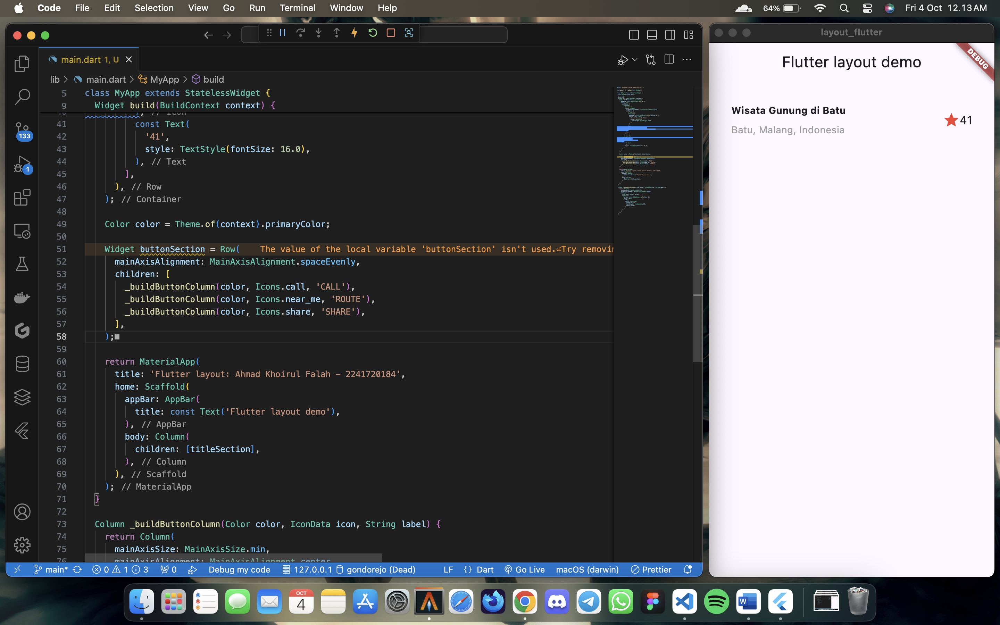

### **Langkah 3: Tambah button section ke body**

Tambahkan variabel buttonSection ke dalam `body`

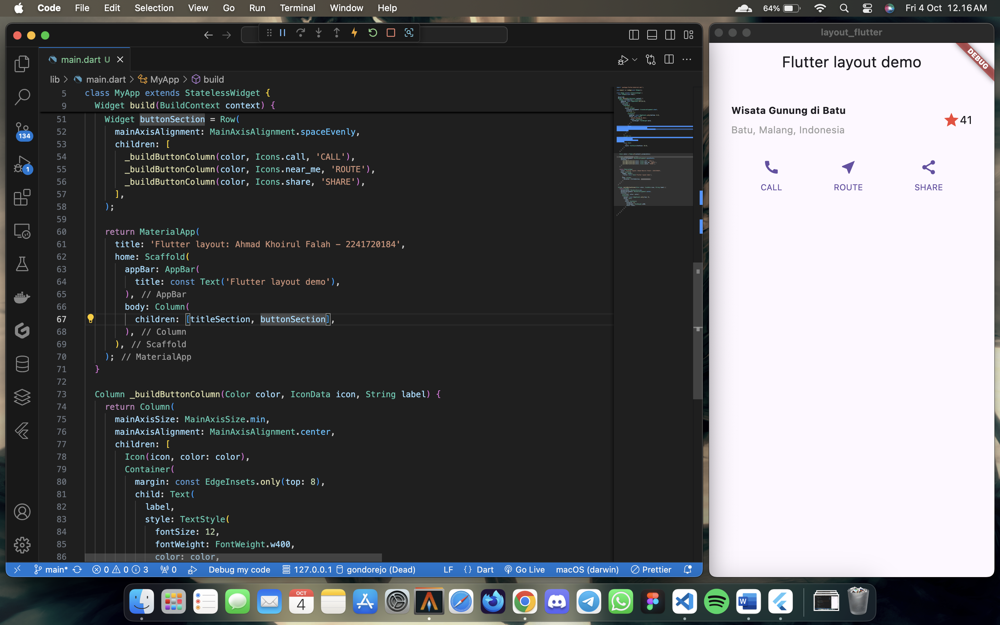

## **Praktikum 3: Implementasi text section**

### **Langkah 1: Buat widget textSection**

Tentukan bagian teks sebagai variabel. Masukkan teks ke dalam `Container` dan tambahkan padding di sepanjang setiap tepinya. Tambahkan kode berikut tepat di bawah deklarasi `buttonSection`:

```Dart
Widget textSection = Container(
  padding: const EdgeInsets.all(32),
  child: const Text(
    'Carilah teks di internet yang sesuai '
    'dengan foto atau tempat wisata yang ingin '
    'Anda tampilkan. '
    'Tambahkan nama dan NIM Anda sebagai '
    'identitas hasil pekerjaan Anda. '
    'Selamat mengerjakan 🙂.',
    softWrap: true,
  ),
);
```

Dengan memberi nilai softWrap = true, baris teks akan memenuhi lebar kolom sebelum membungkusnya pada batas kata.

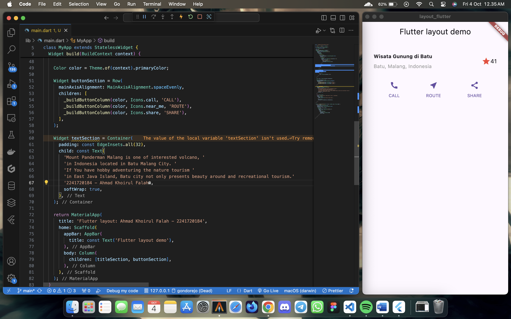

### **Langkah 2: Tambahkan variabel text section ke body**

Tambahkan widget variabel textSection ke dalam body

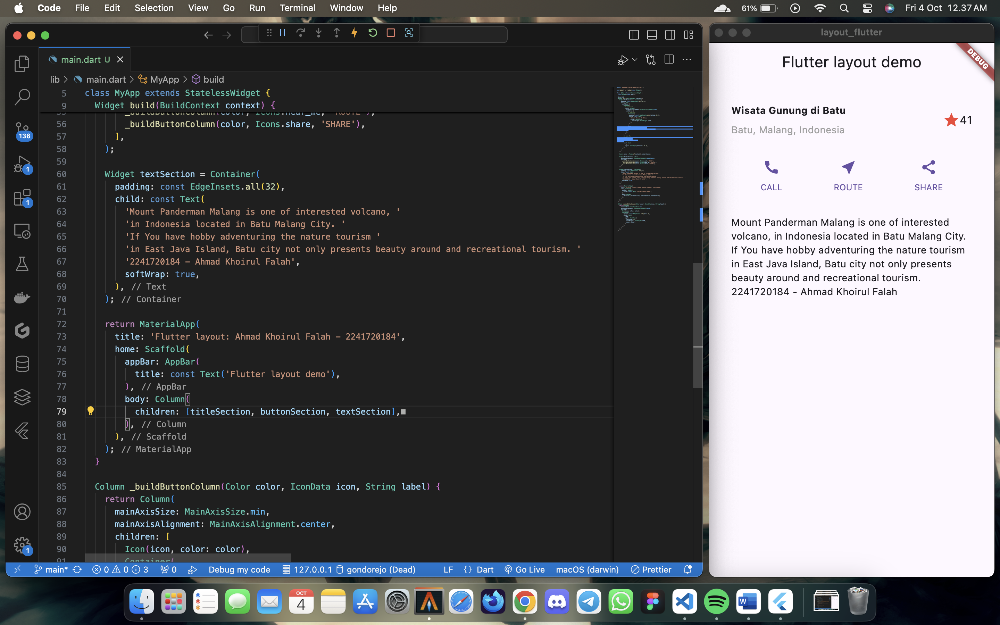

## **Praktikum 4: Implementasi image section**

### **Langkah 1: Siapkan aset gambar**

Anda dapat mencari gambar di internet yang ingin ditampilkan. Buatlah folder `images` di root project **layout_flutter**. Masukkan file gambar tersebut ke folder `images`, lalu set nama file tersebut ke file `pubspec.yaml`

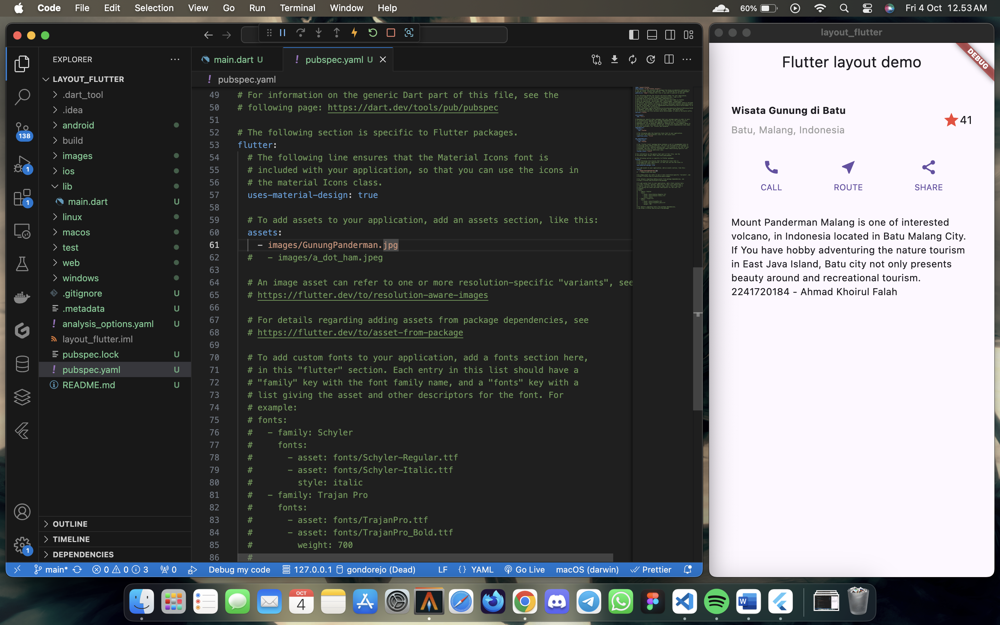

### **Langkah 2: Tambahkan gambar ke body**

Tambahkan aset gambar ke dalam `body`

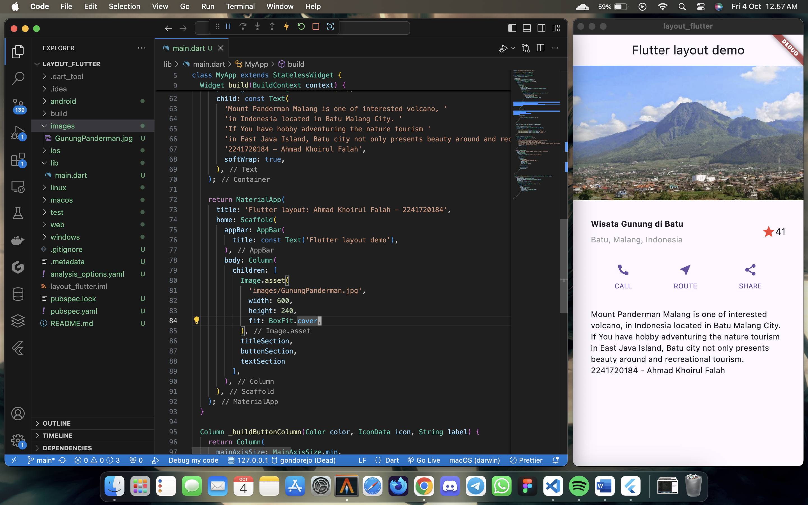

`BoxFit.cover` memberi tahu kerangka kerja bahwa gambar harus sekecil mungkin tetapi menutupi seluruh kotak rendernya.

### **Langkah 3: Terakhir, ubah menjadi ListView**

Pada langkah terakhir ini, atur semua elemen dalam `ListView`, bukan Column, karena `ListView` mendukung scroll yang dinamis saat aplikasi dijalankan pada perangkat yang resolusinya lebih kecil.

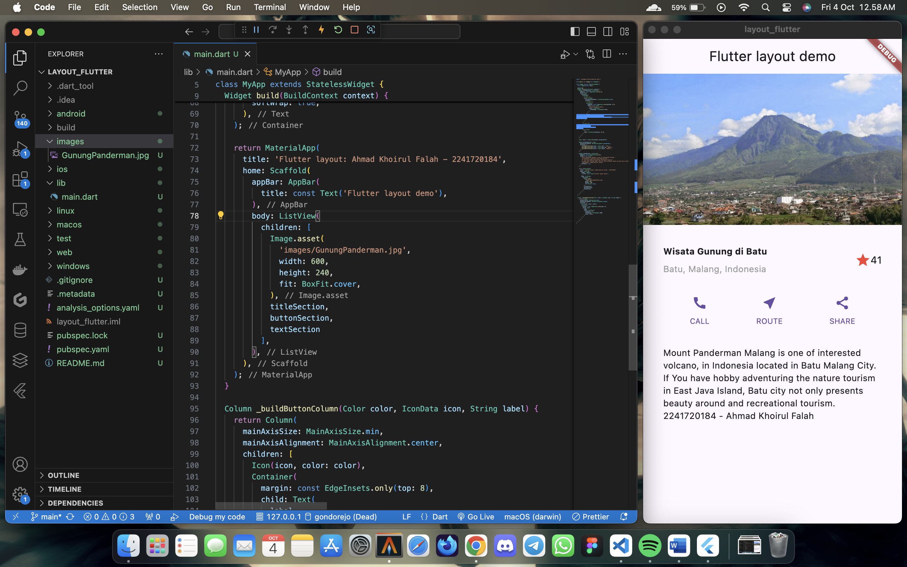

## **Praktikum 5: Membangun Navigasi di Flutter**

### **Langkah 1: Siapkan project baru**

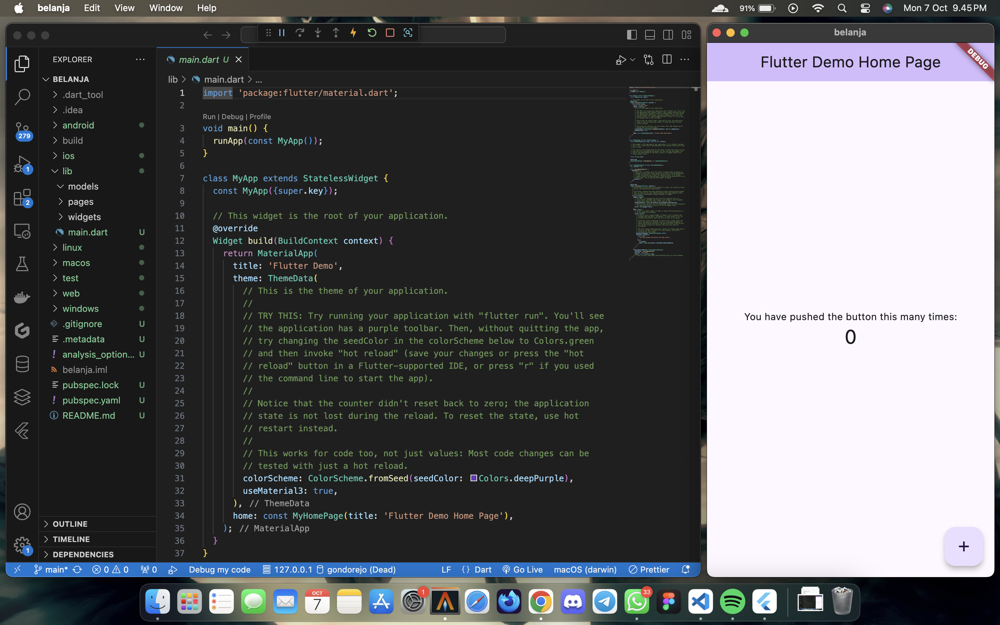

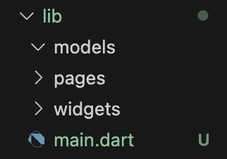

### **Langkah 2: Mendefinisikan Route**

Buatlah dua buah file dart dengan nama `home_page.dart` dan `item_page.dart` pada folder **pages**. Untuk masing-masing file, deklarasikan `class HomePage` pada file `home_page.dart` dan `ItemPage` pada `item_page.dart`. Turunkan class dari `StatelessWidget`.

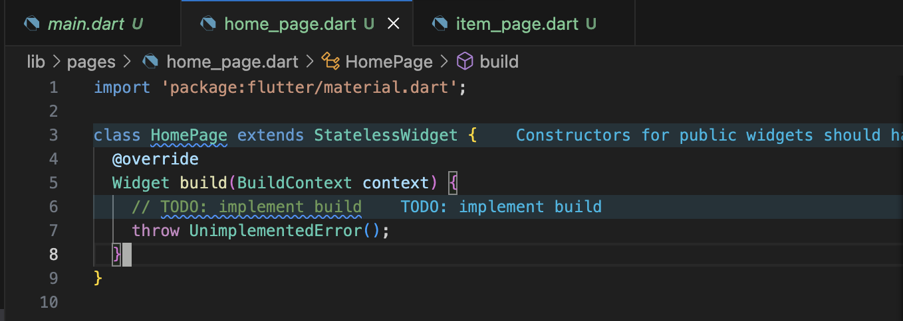

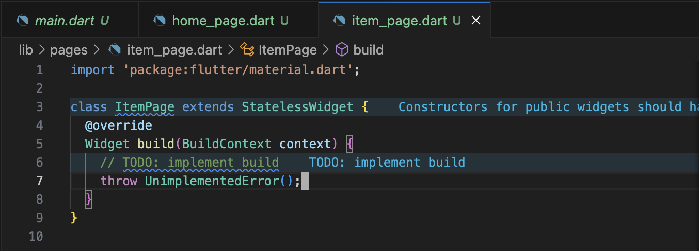

### **Langkah 3: Lengkapi Kode di `main.dart`**

Setelah kedua halaman telah dibuat dan didefinisikan, bukalah file `main.dart`. Pada langkah ini anda akan mendefinisikan **Route** untuk kedua halaman tersebut. Definisi penamaan **route** harus bersifat **unique**. Halaman **HomePage** didefinisikan sebagai **/**. Dan halaman **ItemPage** didefinisikan sebagai **/item**. Untuk mendefinisikan halaman awal, anda dapat menggunakan `named argument initialRoute`.

### **Langkah 4: Membuat data model**

Sebelum melakukan perpindahan halaman dari `HomePage` ke `ItemPage`, dibutuhkan proses pemodelan data. Pada desain mockup, dibutuhkan dua informasi yaitu nama dan harga. Untuk menangani hal ini, buatlah sebuah file dengan nama `item.dart` dan letakkan pada folder **models**. Pada file ini didefinisikan pemodelan data yang dibutuhkan.

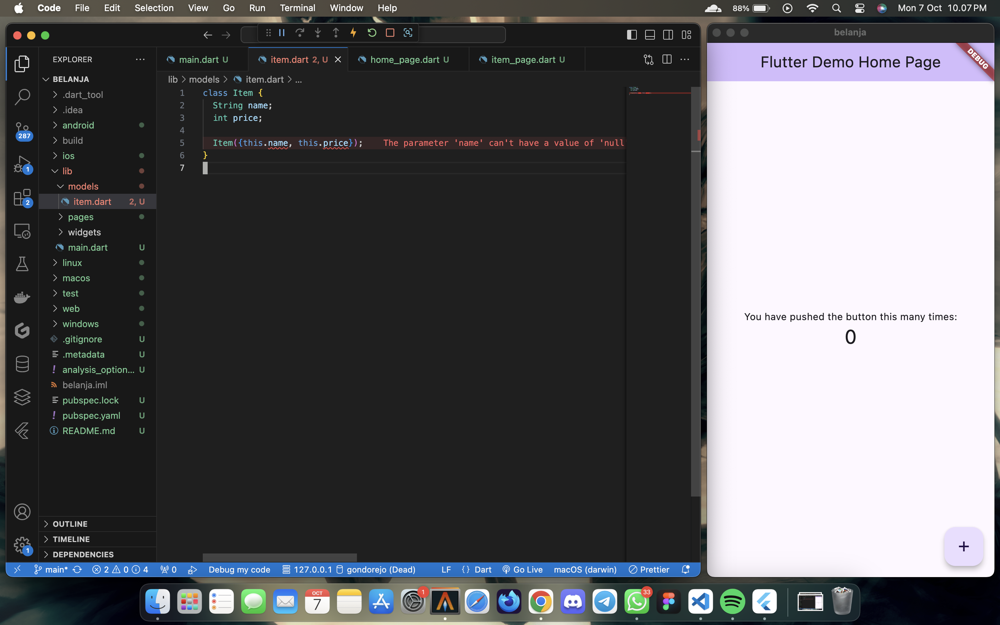

### **Langkah 5: Lengkapi kode di class `HomePage`**

Pada halaman `HomePage` terdapat `ListView` widget. Sumber data ListView diambil dari model List dari object Item. Gambaran kode yang dibutuhkan untuk melakukan definisi model dapat anda lihat sebagai berikut.

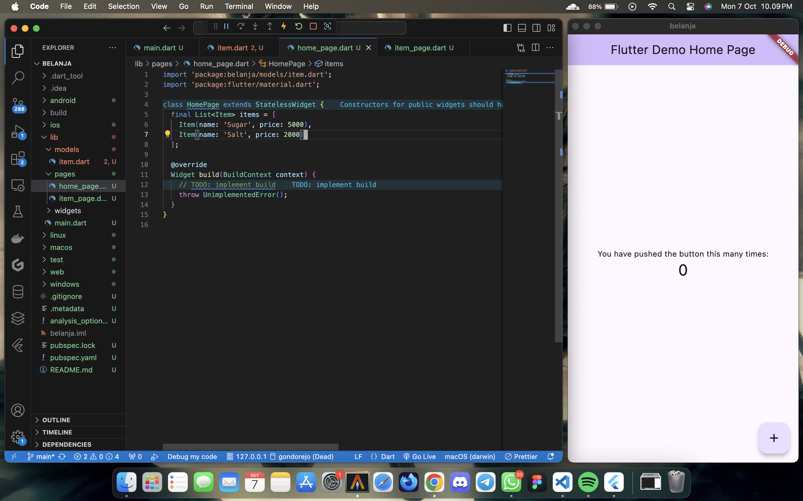

### **Langkah 6: Membuat ListView dan itemBuilder**

Untuk menampilkan `ListView` pada praktikum ini digunakan `itemBuilder`. Data diambil dari definisi model yang telah dibuat sebelumnya. Untuk menunjukkan batas data satu dan berikutnya digunakan widget `Card`. Kode yang telah umum pada bagian ini tidak ditampilkan. Gambaran kode yang dibutuhkan dapat anda lihat sebagai berikut.

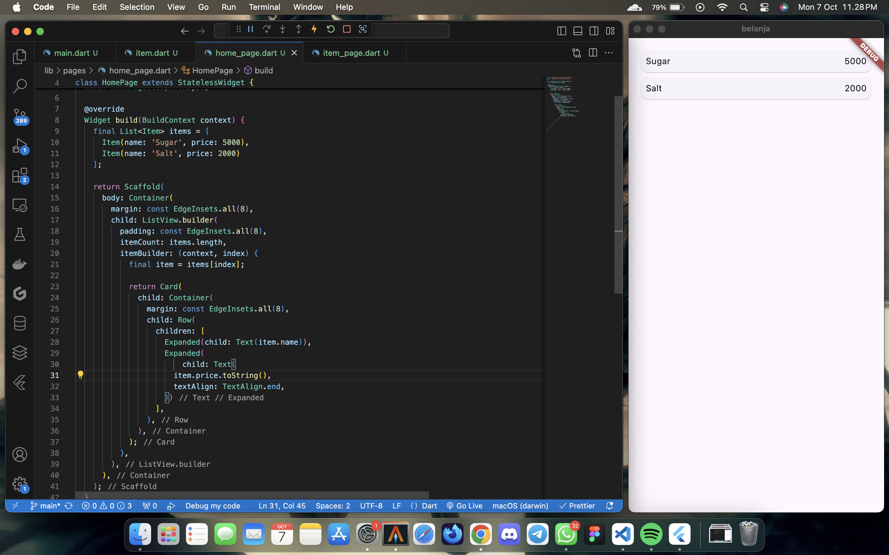

### **Langkah 7: Menambahkan aksi pada ListView**

Item pada ListView saat ini ketika ditekan masih belum memberikan aksi tertentu. Untuk menambahkan aksi pada ListView dapat digunakan widget `InkWell` atau `GestureDetector`. Perbedaan utamanya `InkWell` merupakan material widget yang memberikan efek ketika ditekan. Sedangkan `GestureDetector` bersifat umum dan bisa juga digunakan untuk gesture lain selain sentuhan. Pada praktikum ini akan digunakan widget `InkWell`.

Untuk menambahkan sentuhan, letakkan cursor pada widget pembuka `Card`. Kemudian gunakan shortcut quick fix dari VSCode (**Ctrl + .** pada Windows atau **Cmd + .** pada MacOS). Sorot menu `wrap with widget...` Ubah nilai widget menjadi `InkWell` serta tambahkan named argument `onTap` yang berisi fungsi untuk berpindah ke halaman ItemPage.

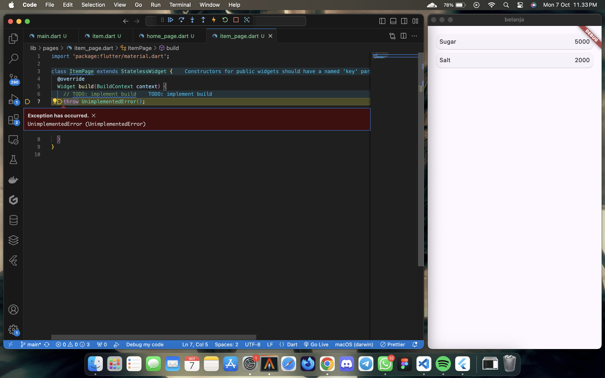

---

1. Untuk melakukan pengiriman data ke halaman berikutnya, cukup menambahkan informasi arguments pada penggunaan `Navigator`. Perbarui kode pada bagian `Navigator` menjadi seperti berikut.

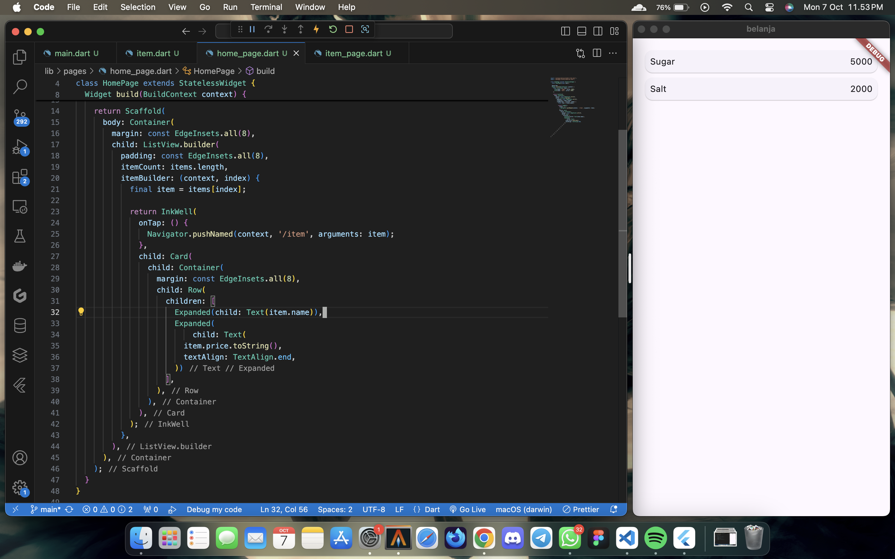

2. Pembacaan nilai yang dikirimkan pada halaman sebelumnya dapat dilakukan menggunakan `ModalRoute`. Tambahkan kode berikut pada blok fungsi build dalam halaman `ItemPage`. Setelah nilai didapatkan, anda dapat menggunakannya seperti penggunaan variabel pada umumnya.


3. Pada hasil akhir dari aplikasi belanja yang telah anda selesaikan, tambahkan atribut foto produk, stok, dan rating. Ubahlah tampilan menjadi GridView seperti di aplikasi marketplace pada umumnya.

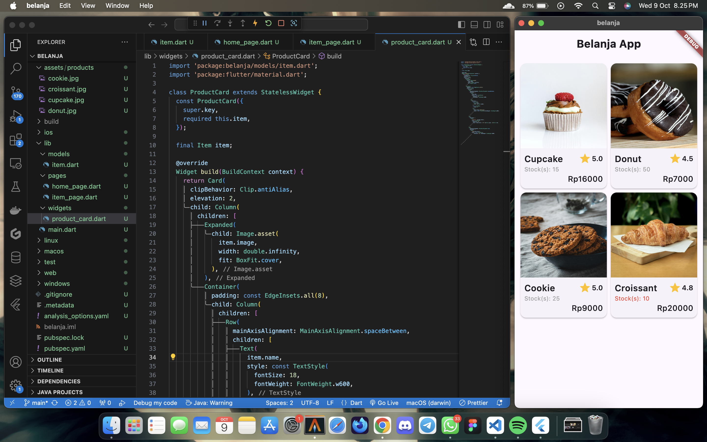

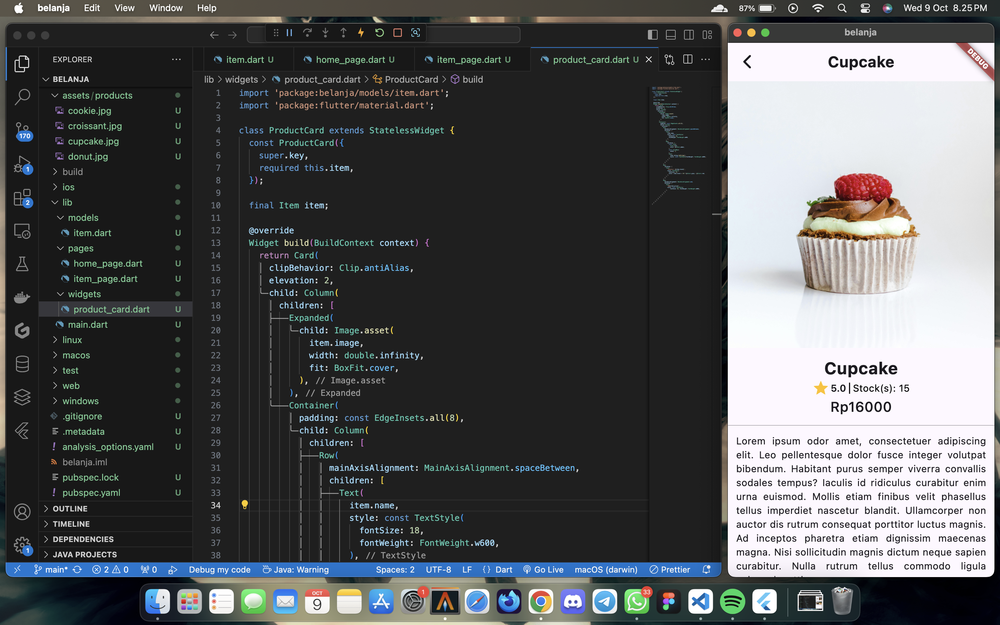

4. Silakan implementasikan Hero widget pada aplikasi belanja

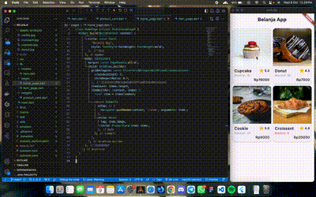

5. Sesuaikan dan modifikasi tampilan sehingga menjadi aplikasi yang menarik. Selain itu, pecah widget menjadi kode yang lebih kecil. Tambahkan Nama dan NIM di footer aplikasi belanja Anda.

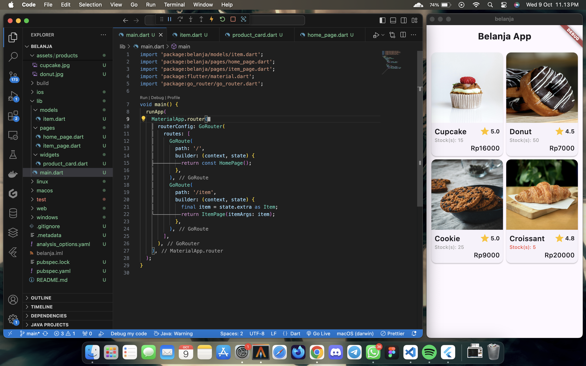
