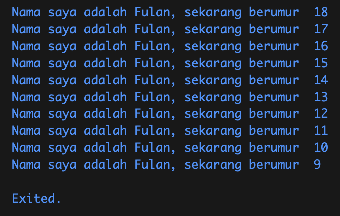

# #02 | Pengantar Bahasa Pemrograman Dart - Bagian 1

## Soal 1
Kode program:

Hasil run program:

## Soal 2
Mengapa sangat penting untuk memahami bahasa pemrograman Dart sebelum kita menggunakan framework Flutter ? Jelaskan!\
**Jawab**: Karena ketika paham mengenai fundamental dari bahasa Dart akan memudahkan kita saat menggunakan framework flutter.

## Soal 3
Rangkumlah materi dari codelab ini menjadi poin-poin penting yang dapat Anda gunakan untuk membantu proses pengembangan aplikasi mobile menggunakan framework Flutter.

- Dart merupakan bahasa OOP dan bahasa inti dari framework Flutter.
- Dart bertujuan untuk kelebihan dari sebagian besar bahasa tingkat dengan fitur-fitur bahasa pemprograman saat ini, antara lain:
    - Productive tooling
    - Garbage collection
    - Type annotations (opsional)
    - Statically typed
    - Portability
- Dart berawal fokus pada web develompent yang bertujuan utama untuk menggantikan Javascript JavaScript tidak menyediakan ketahanan seperti banyak bahasa pemrograman lainnya.
- Dart menawarkan performa terbaik dan tools yang lebih baik untuk project bersekala besar.
- Dengan tetap mempertahankan type annotations bersifat opsional dan menambahkan fitur OOP, Dart dapat menyeimbangkan dua fitur utama yaitu fleksibilitas dan ketangguhan.
- Cara mengeksekusi kode program Dart dapat dilakukan dengan dua cara, yaitu:
    - Dart virtual machines (VMs)
    - JavaScript compilations
- Kode Dart dapat dieksekusi pada lingkungan yang mendukung bahasa Dart. Lingkungan tersebut perlu memperhatikan fitur-fitur penting seperti:
    - Runtime systems
    - Dart core libraries
    - Garbage collectors
- Eksekusi kode Dart dapat beroperasi dalam dua mode:
    - Just-In-Time (JIT) adalah tempat kode sumber dikompilasi sesuai kebutuhan. Dart VM memuat dan mengkompilasi source code ke kode mesin asli (native). Pendekatan ini digunakan untuk menjalankan kode pada command line atau selama proses pengembangan aplikasi mobile yang dapat memanfaatkan fitur seperti debugging dan hot reload.
    - Ahead-Of-Time (AOT) adalah dimana Dart VM dan kode Anda dikompilasi sebelumnya, VM bekerja lebih seperti sistem runtime Dart, yang menyediakan garbage collector dan metode-metode native dari Dart Software Development Kit (SDK) pada aplikasi. Pendekatan ini memiliki keuntungan performa yang sangat besar dibandingkan kompilasi JIT, tetapi fitur lain seperti debugging dan hot reload tidak tersedia.
