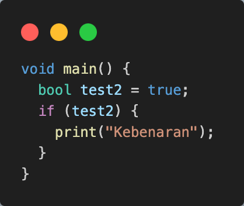

# **#03 | Pengantar Bahasa Pemrograman Dart - Bagian 2**

## **Soal 1**

### **Praktikum 1: Menerapkan Control Flows ("if/else")**

#### **Langkah 1:**
Ketik atau salin kode program berikut ke dalam fungsi main()

```
String test = "test2";
if (test == "test1") {
    print("Test1");
} else If (test == "test2") {
    print("Test2");
} Else {
    print("Something else");
}

if (test == "test2") print("Test2 again");
```


#### **Langkah 2:**
Silahkan coba eksekusi (Run) kode pada langkah 1 tersebut. Apa yang terjadi? Jelaskan!

**Jawab**:\


Terjadi error. Error disebabkan karena terdapat kesalahan penulisan pada `else If` dan `Else` yang seharusnya ditulis `else if` dan `else`.

**Kode program setelah diperbaiki**:\


**Run program setealah diperbaiki**:\


#### **langkah 3:**
Tambahkan kode program berikut, lalu coba eksekusi (Run) kode Anda.

```
String test = "true";
if (test) {
   print("Kebenaran");
}
```


Apa yang terjadi ? Jika terjadi error, silahkan perbaiki namun tetap menggunakan if/else.

**Jawab**:\


Terjadi error pada variabel `test` karena sudah dideklarasikan dan pada kondisi `if`. Menurut saya, ada 2 cara untuk memperbaiki error tersebut, yaitu:

- Perbaikan pertama, merubah nama variabel dan membuat kondisi jika variabel sama dengan `String` `"true"`
  

  
  
  **Penjelasan**: Terdapa `if statement` dengan kondisi jika `test2 == "true"`, maka akan menjalankan `print("Kebenaran");`
  
- Mengganti tipe data variabel menjadi `bool`
  

  

### **Praktikum 2: Menerapkan Perulangan "while" dan "do-while"**

#### **langkah 1:**
Ketik atau salin kode program berikut ke dalam fungsi main().

```
while (counter < 33) {
  print(counter);
  counter++;
}
```


#### **Langkah 2:**
Silahkan coba eksekusi (Run) kode pada langkah 1 tersebut. Apa yang terjadi? Jelaskan! Lalu perbaiki jika terjadi error.

**Jawab**:\


Terdapat error pada `counter` karena belum dideklarasi dan diinisialisasi.


**Penjelasan**: Kode tersebut melakukan perulangan menggunakan `while` dengan kondisi `counter < 33`. Ketika nilai `counter` belum memenuhi kondisi dari perulangan, maka akan menampilkan nilai dari `counter` dan kemudian melakukan icrement `counter++`. Perulangan akan terus berjalan sampai nilai `counter` adalah `32`.


#### **Langkah 3:**
Tambahkan kode program berikut, lalu coba eksekusi (Run) kode Anda.

```
do {
  print(counter);
  counter++;
} while (counter < 77);
```


Apa yang terjadi ? Jika terjadi error, silakan perbaiki namun tetap menggunakan do-while.\

**Jawab**:\


**Penjelasan**: Sebelum dilakukan perulangan, program akan dijalankan untuk menampilkan nilai `counter` dan me-increment nilai `counter` yang selanjutnya dilakukan perulangan dengan kondisi `counter < 77`.\
Tambahan: karena `counter` sudah dilakukan perulangan pada **Langkah 1**, maka pada **Langkah 2** nilai awal `counter` adalah 32.

### **4. Praktikum 3: Menerapkan Perulangan "for" dan "break-continue"**

#### **Langkah 1:**
Ketik atau salin kode program berikut ke dalam fungsi main().

```
for (Index = 10; index < 27; index) {
  print(Index);
}
```


#### **Langkah 2:**
Silakan coba eksekusi (Run) kode pada langkah 1 tersebut. Apa yang terjadi? Jelaskan! Lalu perbaiki jika terjadi error.

**Jawab**:\


Terjadi error. Error tersebut dikarenakan:
1. `Index` belum dideklarasikan dan penulisan nama yang salah yang seharusnya menggunakan lowercase pada huruf pertama variabel
2. Terjadi infinite loop dikarenakan tidak ada perubahan `expression` ketika loop dijalankan.

### **langkah 3:**
Tambahkan kode program berikut di dalam for-loop, lalu coba eksekusi (Run) kode Anda.

```
If (Index == 21) break;
Else If (index > 1 || index < 7) continue;
print(index);
```


Apa yang terjadi ? Jika terjadi error, silakan perbaiki namun tetap menggunakan for dan break-continue.

**Jawab**:\


Terdapat error pada penulisan variabel `index`, `if`, dan `else`. Pada statement `if` jika memiliki lebih dari 1 kondisi, maka harus membungkus setiap kondisi mengguanakan curly braces (`{}`).

**Perbaikan**:


**Penjelasan**: ketika program dijalankan, akan melakukan perulangan dengan kondisi `index < 27` dengan expression `index++`. di dalam perulangan terdapat statement `if (index == 21)` yang akan menghentikan kode program ketika nilai `index` adalah `21`. Jika kondisi pada `if` tidak sesuai, maka program akan tetap berjalan untuk melakukan cek apakah `index` bernilai lebih dari `1` atau lebih kurang dari `7`, jika benar maka akan menampilkan nilai `index` saat ini.

## **Soal 2**
Buatlah sebuah program yang dapat menampilkan bilangan prima dari angka 0 sampai 201 menggunakan Dart. Ketika bilangan prima ditemukan, maka tampilkan nama lengkap dan NIM Anda.


