# **#03 | Pengantar Bahasa Pemrograman Dart - Bagian 2**

## **Soal 1**

### **Praktikum 1: Eksperimen Tipe Data List**

#### **Langkah 1:**
Ketik atau salin kode program berikut ke dalam `void main()`.

```
var list = [1, 2, 3];
assert(list.length == 3);
assert(list[1] == 2);
print(list.length);
print(list[1]);

list[1] = 1;
assert(list[1] == 1);
print(list[1]);
```

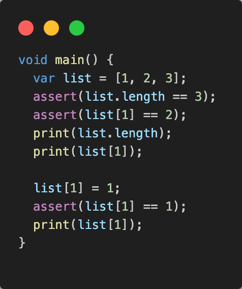

#### **Langkah 2:**
Silahkan coba eksekusi (Run) kode pada langkah 1 tersebut. Apa yang terjadi? Jelaskan!

**Jawab:**\
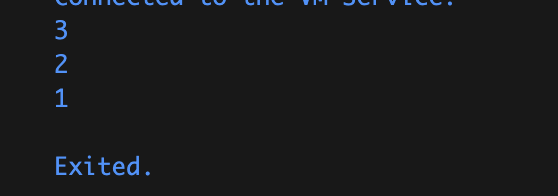

**Penjelasan:**
1. Mendeklarasikan list.
2. Melakukan assertion untuk mengecek apakah panjang list sama dengan 3. Jika panjang list tidak sama dengan 3, maka akan terjadi error ketika dijalankan dan program akan berhenti lalu menampilkan error pada debug. Dalam hal ini, assertion tersebut bernilai `true`.
3. Melakukan assertion pada list index ke-1 apakah sama dengan 2. Dalam hal ini, assertion akan menghasilkan nilai `true`.
4. Melakukan print untuk panjang list. Output yang dihasilkan adalah `3`.
5. Melakukan print index ke-1 dari list. Output yang dihasilkan adalah `2`.
6. Merubah nilai index ke-1 menjadi `1`.
7. Melakukan assertion apakah index ke-1 sama dengan 1. Assertion tersebut menghasilkan `true`.
8. Melakukan print index ke-1 yang menghasilkan output `1`.

#### **Langkah 3:**
Ubah kode pada langkah 1 menjadi variabel final yang mempunyai index = 5 dengan default value = null. Isilah nama dan NIM Anda pada elemen index ke-1 dan ke-2. Lalu print dan capture hasilnya.

Apa yang terjadi ? Jika terjadi error, silahkan perbaiki.

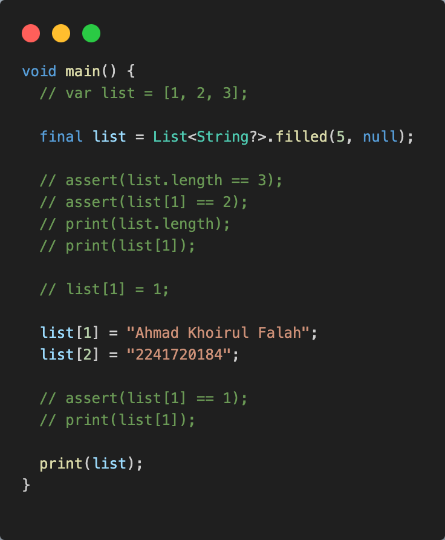

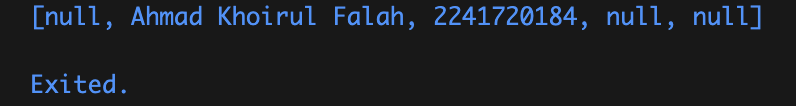

**Penjelasan:**
- Membuat List/Array menggunakan `Collection List` dan constructor `filled()`.
- `List<String?>` digunakan untuk menampung data `String` atau `null` ketika data belum diinisialisasikan.
- Constructor `filled` memiliki 3 parameter:
    - Parameter pertama (`length`) digunakan untuk menentukan panjang. Pada `list` pada kode langkah ketiga memiliki panjang 5.
    - Parameter kedua (`fill`) digunakan untuk menginisialisasikan nilai awal dari `index`.Pada kode langkah ketiga `List` diinisialisasikan `null`.
    - Parameter ketiga (`growable`) digunakan untuk menentukan apakah panjang dari `list` dapat diubah atau tidak menggunakan tipe data `bool`. Secara default, `growable`memiliki nilai `false`. Pada langkah ketiga, `growable` tidak ditulis yang berarti `growable` bernilai false.

### **Praktikum 2: Eksperimen Tipe Data Set**

#### **Langkah 1:**
Ketik atau salin kode program berikut ke dalam fungsi `main()`.
```
var halogens = {'fluorine', 'chlorine', 'bromine', 'iodine', 'astatine'};
print(halogens);
```

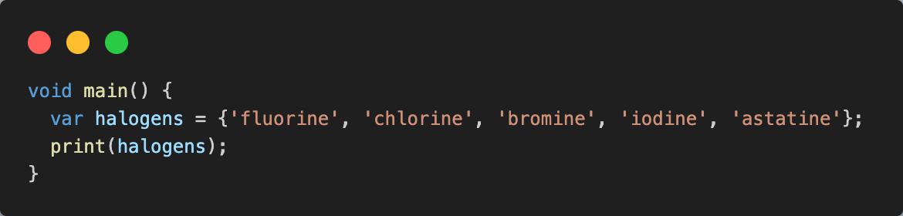

#### **Langkah 2:**
Silahkan coba eksekusi (Run) kode pada langkah 1 tersebut. Apa yang terjadi? Jelaskan! Lalu perbaiki jika terjadi error.

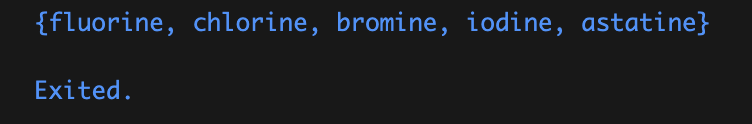

**Penjelasan:** Membuat `Collection Set` untuk membuat objek bernama `halogens` yang berisi `{'fluorine', 'chlorine', 'bromine', 'iodine', 'astatine'}`

#### **Langkah 3:**
Tambahkan kode program berikut, lalu coba eksekusi (Run) kode Anda.
```
var names1 = <String>{};
Set<String> names2 = {}; // This works, too.
var names3 = {}; // Creates a map, not a set.

print(names1);
print(names2);
print(names3);
```

Apa yang terjadi ? Jika terjadi error, silahkan perbaiki namun tetap menggunakan ketiga variabel tersebut. Tambahkan elemen nama dan NIM Anda pada kedua variabel Set tersebut dengan dua fungsi berbeda yaitu `.add()` dan `.addAll()`. Untuk variabel Map dihapus, nanti kita coba di praktikum selanjutnya.


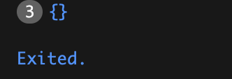

**Penjelasan:** Membuat objek kosong dari colletion `Set`.

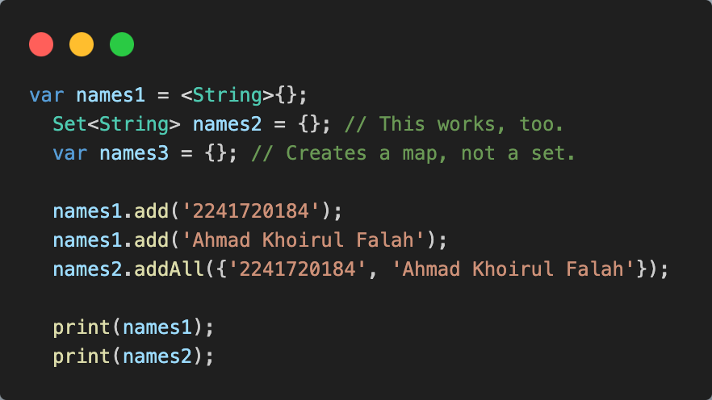

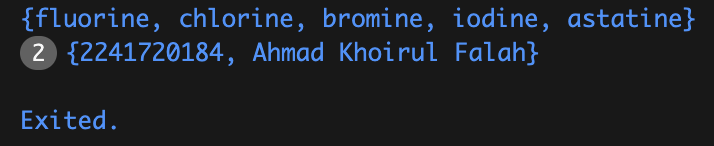

### **4. Praktikum 3: Eksperimen Tipe Data Maps**

#### **Langkah 1:**
Ketik atau salin kode program berikut ke dalam fungsi `main()`.

````
var gifts = {
  // Key:    Value
  'first': 'partridge',
  'second': 'turtledoves',
  'fifth': 1
};

var nobleGases = {
  2: 'helium',
  10: 'neon',
  18: 2,
};

print(gifts);
print(nobleGases);
````

#### **Langkah 2:**
Silakan coba eksekusi (Run) kode pada langkah 1 tersebut. Apa yang terjadi? Jelaskan! Lalu perbaiki jika terjadi error.

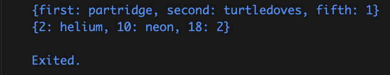

**Penjelasan:** Membuat objek yang berisikan key dan value yang saling berasosiasi.

#### **Langkah 3:**
Tambahkan kode program berikut, lalu coba eksekusi (Run) kode Anda.

```
var mhs1 = Map<String, String>();
gifts['first'] = 'partridge';
gifts['second'] = 'turtledoves';
gifts['fifth'] = 'golden rings';

var mhs2 = Map<int, String>();
nobleGases[2] = 'helium';
nobleGases[10] = 'neon';
nobleGases[18] = 'argon';
```

Apa yang terjadi ? Jika terjadi error, silakan perbaiki.

**Jawab:** Tidak terjadi apa-apa. `Map` bernama `mhs1` dan `mhs2` dideklarasikan namun tidak digunakan.

Tambahkan elemen nama dan NIM Anda pada tiap variabel di atas (gifts, nobleGases, mhs1, dan mhs2). Dokumentasikan hasilnya dan buat laporannya!

```
  gifts.addAll({
    'nim': '2241720184',
    'nama': 'Ahmad Khoirul Falah'
  });

  nobleGases.addAll({
    22: '2241720184',
    3: 'Ahmad Khoirul Falah'
  });

  mhs1.addAll({
    'nim': '2241720184',
    'nama': 'Ahmad Khoirul Falah'
  });

  mhs2.addAll({
    22: '2241720184',
    3: 'Ahmad Khoirul Falah'
  });
```

### **5. Praktikum 4: Eksperimen Tipe Data List: Spread dan Control-flow Operators**

#### **Langkah 1:**
Ketik atau salin kode program berikut ke dalam fungsi `main()`.

```
var list = [1, 2, 3];
var list2 = [0, ...list];
print(list1);
print(list2);
print(list2.length);
```

#### **Langkah 2:**
Silakan coba eksekusi (Run) kode pada langkah 1 tersebut. Apa yang terjadi? Jelaskan! Lalu perbaiki jika terjadi error.

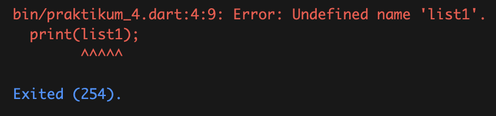

Terjadi error karena salah penulisan nama variabel.

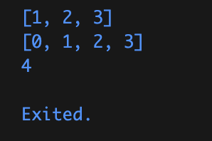

**Penjelasan:** `...` yang disebut **spread operator** meruparakn cara ringkah untuk memasukkan multiple values ke dalam suatu `collection`.

#### **Langkah 3:**
Tambahkan kode program berikut, lalu coba eksekusi (Run) kode Anda.

```
list1 = [1, 2, null];
print(list1);
var list3 = [0, ...?list1];
print(list3.length);
```

Apa yang terjadi ? Jika terjadi error, silakan perbaiki.

Terjadi error karena `list1` belum dideklarasikan.

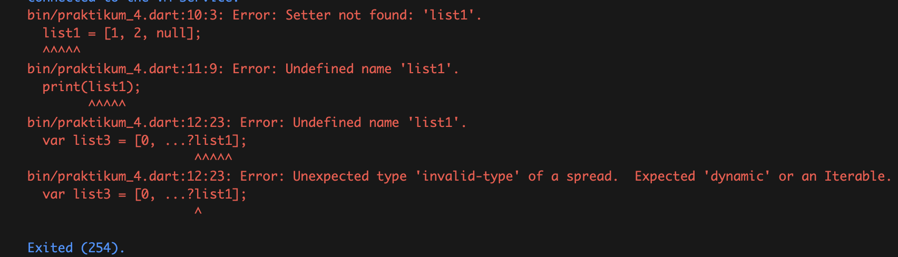

Tambahkan variabel list berisi NIM Anda menggunakan Spread Operators. Dokumentasikan hasilnya dan buat laporannya!

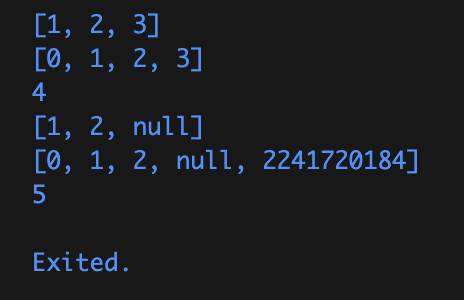

**Penjelasan:** `...?` merupaka spread operator yang digunakna untuk `null-able` agar list dapat menerima isi list yang bernilai `null`.

#### **Langkah 4:**
Tambahkan kode program berikut, lalu coba eksekusi (Run) kode Anda.

```
var nav = ['Home', 'Furniture', 'Plants', if (promoActive) 'Outlet'];
print(nav);
```

Apa yang terjadi ? Jika terjadi error, silakan perbaiki. Tunjukkan hasilnya jika variabel `promoActive` ketika `true` dan `false`.

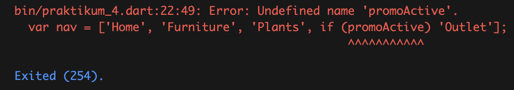

Terjadi error karena `promoActive` belum dideklarasikan.

Ketika `promoActive` `true`:

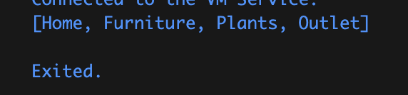

Ketika `promoActive` `false`:

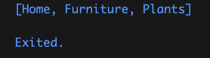

**Penjelasan**: `Collection if` digunakan untuk membuat statement `if` di dalam suatu `list`, `map`, dan `set`.

#### **Langkah 5:**
Tambahkan kode program berikut, lalu coba eksekusi (Run) kode Anda.

```
var nav2 = ['Home', 'Furniture', 'Plants', if (login case 'Manager') 'Inventory'];
print(nav2);
```

Apa yang terjadi ? Jika terjadi error, silakan perbaiki. Tunjukkan hasilnya jika variabel `login` mempunyai kondisi lain.

Terjadi error karena `login` belum dideklarasikan.

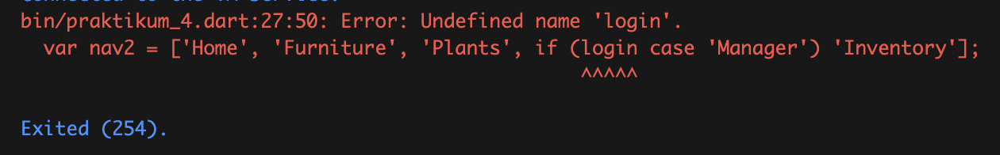

Ketika kondisi `true`:

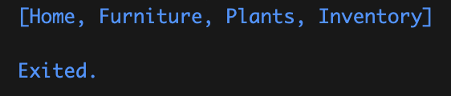

Kondisi lain:

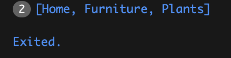

Langkah 6:
Tambahkan kode program berikut, lalu coba eksekusi (Run) kode Anda.

```
var listOfInts = [1, 2, 3];
var listOfStrings = ['#0', for (var i in listOfInts) '#$i'];
assert(listOfStrings[1] == '#1');
print(listOfStrings);
```

Apa yang terjadi ? Jika terjadi error, silakan perbaiki. Jelaskan manfaat **Collection For** dan dokumentasikan hasilnya.

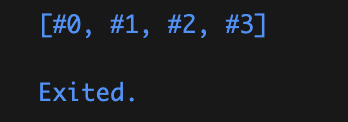

**Penjelasan**: Menambahkan elemen list baru dengan cara melakukan perulangan pada tiap elemen list pada `listOfints` untuk ditambahkan ke dalam `listOfStrings`.

**Collection For** memungkinkan untuk menambahkan elemen-elemen ke dalam list, set, atau map secara dinamis menggunakan perulangan.

### **6. Praktikum 5: Eksperimen Tipe Data Records**

#### **Langkah 1:**
Ketik atau salin kode program berikut ke dalam fungsi `main()`.

```
var record = ('first', a: 2, b: true, 'last');
print(record)
```

#### **Langkah 2:**
Silakan coba eksekusi (Run) kode pada langkah 1 tersebut. Apa yang terjadi? Jelaskan! Lalu perbaiki jika terjadi error.

Terjadi error karena kurang titik koma (`;`) pada print().

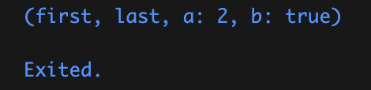

**Penjelasan:** Membuat dan menampilkan sebuah `record` yang dapat menyimpan berbagai jenis objek menjadi satu objek.

#### **Langkah 3:**
Tambahkan kode program berikut di luar scope void `main()`, lalu coba eksekusi (Run) kode Anda.

```
(int, int) tukar((int, int) record) {
  var (a, b) = record;
  return (b, a);
}
```


Apa yang terjadi ? Jika terjadi error, silakan perbaiki. Gunakan fungsi `tukar()` di dalam `main()` sehingga tampak jelas proses pertukaran value field di dalam Records.

```
var record2 = (1, 2);
var tukarRecord = tukar(record2);
print(tukarRecord);
```

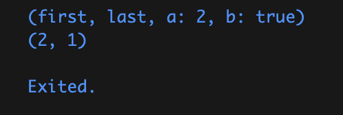

**Penjelasan:** Fungsi `tukas()` digunakan untuk menukar elemen dalam `record2`.

#### **Langkah 4:**
Tambahkan kode program berikut di dalam scope void `main()`, lalu coba eksekusi (Run) kode Anda.

```
// Record type annotation in a variable declaration:
(String, int) mahasiswa;
print(mahasiswa);
```

Apa yang terjadi ? Jika terjadi error, silakan perbaiki. Inisialisasi field nama dan NIM Anda pada variabel record mahasiswa di atas. Dokumentasikan hasilnya dan buat laporannya!

Terjadi error karena mahasiswa belum diiinisialisasi.

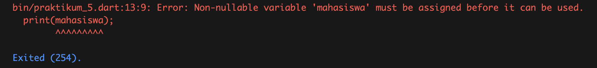

````
(String, int) mahasiswa;
mahasiswa = ('Ahmad Khoirul Falah', 2241720184);
print(mahasiswa);
````

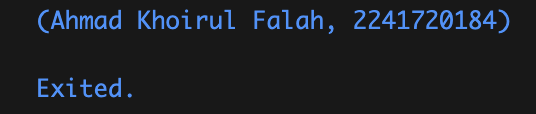

#### **Langkah 5:**
Tambahkan kode program berikut di dalam scope void `main()`, lalu coba eksekusi (Run) kode Anda.

```
var mahasiswa2 = ('first', a: 2, b: true, 'last');

print(mahasiswa2.$1); // Prints 'first'
print(mahasiswa2.a); // Prints 2
print(mahasiswa2.b); // Prints true
print(mahasiswa2.$2); // Prints 'last'
```

Apa yang terjadi ? Jika terjadi error, silakan perbaiki. Gantilah salah satu isi record dengan nama dan NIM Anda, lalu dokumentasikan hasilnya dan buat laporannya!

Terjadi error karena `mahasiswa2` belum dideklarasikan.

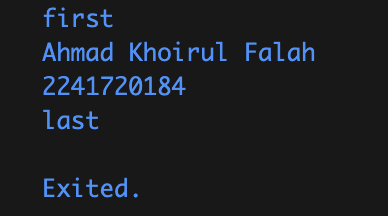

## **Soal 2**
Jelaskan yang dimaksud Functions dalam bahasa Dart!

**Jawab:** Functions dalam Dart adalah blok kode yang dapat dipanggil berulang kali untuk menjalankan tugas tertentu. Sebuah fungsi mempermudah untuk memecah program menjadi bagian-bagian yang lebih kecil dan terorganisir, sehingga membuat kode lebih mudah dipahami dan dikelola.

## **Soal 3**
Jelaskan jenis-jenis parameter di Functions beserta contoh sintaksnya!

**Jawab:** 
- Positional Parameters: Parameter yang diharuskan berada pada urutan tertentu.

```
void greet(String name, int age) {
  print('Hello $name, you are $age years old.');
}

void main() {
  greet('Ahmad', 21);
}
```

- Named Parameters: Parameter yang dipanggil berdasarkan namanya, bukan posisinya.

```
void greet({String name = 'Guest', int age = 18}) {
  print('Hello $name, you are $age years old.');
}

void main() {
  greet(name: 'Ahmad', age: 21);
}
```

- Optional Parameters: Parameter yang tidak harus diberikan nilai saat fungsi dipanggil.

```
void greet(String name, [int? age]) {
  print('Hello $name, you are ${age ?? 'unknown'} years old.');
}

void main() {
  greet('Ahmad');
}
```

## **Soal 4**
Jelaskan maksud Functions sebagai first-class objects beserta contoh sintaknya!

**Jawab:** Functions adalah first-class objects yang berarti functions dapat disimpan dalam variabel, dipassing sebagai parameter, atau dikembalikan dari fungsi lain.

```
void sayHello() {
  print('Hello!');
}

void executeFunction(void Function() func) {
  func(); // Memanggil fungsi yang dipass sebagai parameter
}

void main() {
  var greet = sayHello; // Menyimpan fungsi dalam variabel
  executeFunction(greet); // Memanggil fungsi melalui variabel
}
```

## **Soal 5**
Apa itu Anonymous Functions? Jelaskan dan berikan contohnya!

**Jawab:** Anonymous functions adalah fungsi tanpa nama yang sering digunakan untuk tugas sekali pakai atau sebagai argumen dalam fungsi lain. Anonymous functions sering digunakan dalam callback.

```
void main() {
  var numbers = [1, 2, 3, 4];
  
  numbers.forEach((number) {
    print('Number: $number');
  });
}
```

## **Soal 6**
Jelaskan perbedaan Lexical scope dan Lexical closures! Berikan contohnya!

**Jawab:**
- **Lexical Scope:** Mengacu pada aturan yang menentukan di mana variabel dapat diakses berdasarkan tempat definisi variabel dalam kode. Sebuah variabel hanya dapat diakses di dalam fungsi atau blok di mana ia dideklarasikan.

```
void main() {
  var name = 'Dart'; // Variabel di dalam scope fungsi main
  
  void greet() {
    print('Hello $name'); // Bisa mengakses variabel name
  }

  greet();
}
```

- **Lexical Closures:** Closure terjadi ketika fungsi di dalam mengakses variabel dari lingkup di luar dirinya (lexical scope). Closure akan "menutup" nilai variabel dari lingkup terluarnya agar tetap hidup meskipun lingkup aslinya sudah selesai dieksekusi.

```
Function makeAdder(int addBy) {
  return (int i) => i + addBy; // Menutup variabel addBy
}

void main() {
  var add2 = makeAdder(2); // Fungsi closure menutup addBy = 2
  print(add2(3)); // Output: 5
}
```

## **Soal 7**
Jelaskan dengan contoh cara membuat return multiple value di Functions!

**Jawab:** Dart tidak mendukung multiple return value secara langsung, tetapi kita bisa menggunakan struktur seperti `List`, `Map`, atau membuat `Record` menggunakan class.

**Menggunaan `List`:**
```
List<int> getCoordinates() {
  int x = 10;
  int y = 20;
  return [x, y]; // Mengembalikan List
}

void main() {
  var coordinates = getCoordinates();
  print('x: ${coordinates[0]}, y: ${coordinates[1]}');
}
```

**Menggunakan `Map`:**
```
Map<String, int> getCoordinates() {
  return {'x': 10, 'y': 20}; // Mengembalikan Map
}

void main() {
  var coordinates = getCoordinates();
  print('x: ${coordinates['x']}, y: ${coordinates['y']}');
}
```

**Menggunakan 'Record`:**
```
(int, int) swap(int a, int b) {
  return (b, a);
}

void main() {
  var result = swap(1, 2);
  print(result);  // Output: (2, 1)
}
```
